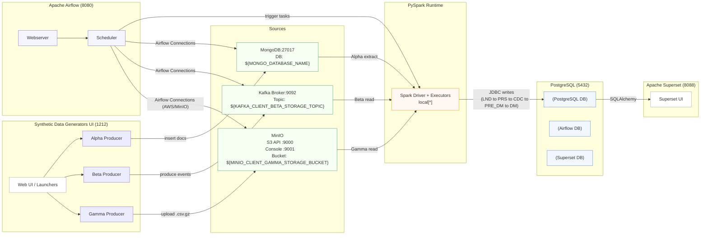
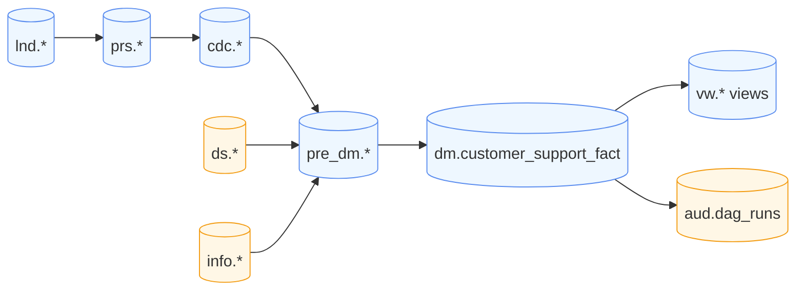

# Insights & Telemetry Platform


> Local, dockerized data platform that ingests synthetic customer-support data from multiple sources (MongoDB, Kafka, and S3/MinIO) into a dimensional warehouse, orchestrated by Airflow and visualized in Superset.


## Table of Contents
- [Insights \& Telemetry Platform](#insights--telemetry-platform)
  - [Table of Contents](#table-of-contents)
  - [Overview](#overview)
  - [Architecture](#architecture)
    - [Topology](#topology)
    - [ETL Data Flow (inside Postgres)](#etl-data-flow-inside-postgres)
  - [Tech Stack](#tech-stack)
  - [Repository Layout](#repository-layout)
  - [Quickstart](#quickstart)
    - [One‑command setup](#onecommand-setup)
    - [Open the UIs](#open-the-uis)
    - [Lifecycle helpers](#lifecycle-helpers)
  - [Configuration](#configuration)
    - [Environment (.env)](#environment-env)
    - [Airflow Connections](#airflow-connections)
    - [Airflow Variables](#airflow-variables)
  - [Pipelines](#pipelines)
    - [Client Alpha — Mongo ➜ Postgres DW](#client-alpha--mongo--postgres-dw)
    - [Client Beta — Kafka ➜ Postgres DW](#client-beta--kafka--postgres-dw)
    - [Client Gamma — MinIO (S3) ➜ Postgres DW](#client-gamma--minio-s3--postgres-dw)
  - [Data Model](#data-model)
  - [Dashboards (Superset)](#dashboards-superset)
  - [Screenshots](#screenshots)
    - [Orchestrator \& Generators UI](#orchestrator--generators-ui)
    - [Airflow](#airflow)
    - [Superset Dashboards](#superset-dashboards)
  - [Synthetic Data Generators](#synthetic-data-generators)
  - [Troubleshooting](#troubleshooting)
  - [License](#license)


## Overview

This repository spins up a complete data playground on your laptop:

- **Sources**: 
  - *Client Alpha* documents in **MongoDB**
  - *Client Beta* events on **Kafka**
  - *Client Gamma* gzipped CSVs in **MinIO (S3-compatible)**

- **Processing**: **Apache Airflow** DAGs run **PySpark** transforms to land raw data, build changefeeds, and load a **dimensional model** in **PostgreSQL**.

- **BI**: **Apache Superset** ships with pre-built connections and a demo dashboard export.

Use it to prototype ETL patterns, data-quality checks, and end-to-end orchestration.


## Architecture

The platform runs locally with Docker Compose. Airflow orchestrates PySpark jobs that extract from MongoDB, Kafka, and MinIO, then land and model data in PostgreSQL for Superset dashboards.

### Topology





### ETL Data Flow (inside Postgres)





## Tech Stack

- **Airflow** (DAG orchestration)
- **PySpark** (ETL/ELT processing)
- **PostgreSQL 15** (landing ➜ CDC ➜ PRS ➜ PRE_DM ➜ DM ➜ DWH)
- **MongoDB** (document source for Alpha)
- **Apache Kafka** (event source for Beta)
- **MinIO** (S3-compatible object storage for Gamma)
- **Apache Superset** (dashboards)
- **Docker Compose** (one-command local stack)


## Repository Layout

```
- .gitignore
- airflow
  - dags
    - Client_Alpha_ETL_Task_Flow.py
    - Client_Beta_ETL_Task_Flow.py
    - Client_Gamma_ETL_Task_Flow.py
    - db_dag_operations.py
- docker
  - airflow.dockerfile
  - orchestration_ui.dockerfile
  - superset.dockerfile
- docs
  - LICENSE
  - README.md
- generators
  - client_alpha_data_generator.py
  - client_beta_data_generator.py
  - client_gamma_data_generator.py
  - db_operations.py
- infra
  - .env**
  - docker-compose.yml
  - entrypoint
    - data_generator_orchestrator.py
    - orchestration_ui_startup.sh
    - postgresql-jdbc.jar
    - sqlite3_db_setup.sql
    - superset_startup.sh
  - platform_setup.sh
  - scripts
    - create_airflow_connections.sh
    - create_airflow_variables.sh
    - create_kafka_topics.sh
    - create_minio_buckets.sh
    - create_postgres_user.sh
    - create_superset_connections.sh
    - import_superset_dashboards.sh
    - print_endpoints.sh
    - wait_for_airflow_components.sh
    - wait_for_containers_health.sh
  - sql
    - 01_database_creation.sql
    - 02_schema_creation.sql
    - 03_ds_schema_tables_creation.sql
    - 04_info_schema_tables_creation.sql
    - 05_aud_schema_tables_creation.sql
    - 06_lnd_schema_tables_creation.sql
    - 07_cdc_schema_tables_creation.sql
    - 08_prs_schema_tables_creation.sql
    - 09_pre_dm_schema_tables_creation.sql
    - 10_dm_schema_tables_creation.sql
    - 11_dwh_schema_tables_creation.sql
    - 12_func_triggers_creation.sql
    - 13_ds_schema_tables_inserts.sql
    - 14_info_schema_tables_inserts.sql
    - 15_vw_schema_views_creation.sql
    - 16_user_creation.sql***
- superset
  - exports
    - dashboard_export.zip
```

**  - These files are system specific and should be created on their own.

*** - Created during runtime.


## Quickstart

> Prereqs: Docker Desktop (or Docker Engine) and Docker Compose v2; Bash-compatible shell.

### One‑command setup

```bash
cd infra
chmod +x platform_setup.sh  # once
./platform_setup.sh setup
```

This builds & starts all services, seeds connections/variables, creates topics/buckets, and imports Superset assets.

### Open the UIs

- **Synthetic Data Generators**: http://localhost:1212  
  Trigger/start the generators for Alpha (Mongo), Beta (Kafka), and Gamma (MinIO).

- **Airflow**: http://localhost:8080  
  Trigger the `Client_*_ETL_Task_Flow` DAGs.

- **Superset**: http://localhost:8088  
  Browse the demo dashboards.

> Tip: `bash scripts/print_endpoints.sh` also prints all service URLs once the stack is up.

### Lifecycle helpers
```bash
./platform_setup.sh start     # start services (if already built)
./platform_setup.sh stop      # stop services (keep data volumes)
./platform_setup.sh status    # show container health (add --watch to stream)
./platform_setup.sh reset     # destroy & recreate everything (DANGEROUS)
```


## Configuration

### Environment (.env)

The Compose file reads settings from `infra/.env`. The scripts assume at least:

- `PROJECT_USER`, `PROJECT_PASSWORD` — shared app credentials
- `POSTGRES_PORT`, `POSTGRES_DATABASE_NAME` — Postgres port and DB name (defaults create `support_insights`, `airflow_db`, `superset_db`)
- `MONGO_PORT`, `MONGO_DATABASE_NAME` — MongoDB port/DB
- `KAFKA_BROKER_PORT` — Kafka broker port
- `MINIO_API_PORT`, `MINIO_CONSOLE_PORT` — MinIO service ports

> Tip: run `bash scripts/print_endpoints.sh` after `docker compose up` to see actual URLs.

### Airflow Connections

Created by `scripts/create_airflow_connections.sh`:

- `postgres_project_connection` — Postgres (DW)
- `mongo_project_connection` — MongoDB (Alpha source)
- `kafka_project_connection` — Kafka (Beta source)
- `minio_project_connection` — AWS-type connection used for MinIO (Gamma source)

### Airflow Variables

- `KAFKA_CLIENT_BETA_STORAGE_TOPIC` — Kafka topic for Beta
- `MINIO_CLIENT_GAMMA_STORAGE_BUCKET` — MinIO bucket for Gamma uploads


## Pipelines

### Client Alpha — Mongo ➜ Postgres DW

- **Source**: MongoDB documents
- **Flow**: `LND` (landing) ➜ `PRS` (persistent) ➜ `CDC` ➜ `PRE_DM` ➜ `DM`
- **Key file**: `airflow/dags/Client_Alpha_ETL_Task_Flow.py`
- **Conn IDs**: `mongo_project_connection`, `postgres_project_connection`

### Client Beta — Kafka ➜ Postgres DW

- **Source**: Kafka topic (`KAFKA_CLIENT_BETA_STORAGE_TOPIC`)
- **Flow**: `LND` ➜ `PRS` ➜ `CDC` ➜ `PRE_DM` ➜ `DM`
- **Key file**: `airflow/dags/Client_Beta_ETL_Task_Flow.py`
- **Conn IDs**: `kafka_project_connection`, `postgres_project_connection`

### Client Gamma — MinIO (S3) ➜ Postgres DW

- **Source**: gzipped CSV batches in MinIO bucket (`MINIO_CLIENT_GAMMA_STORAGE_BUCKET`)
- **Flow**: `LND` ➜ `PRS` ➜ `CDC` ➜ `PRE_DM` ➜ `DM`
- **Key file**: `airflow/dags/Client_Gamma_ETL_Task_Flow.py`
- **Conn IDs**: `minio_project_connection` (AWS-style with endpoint_url), `postgres_project_connection`
- **Expected key format**: `{sequence_number:10d}_client_gamma_support_data_{YYYYMMDD}_{HHMMSS}.csv.gz`


## Data Model

Warehouse lives in Postgres database `support_insights`:

- Schemas: `ds`, `info`, `aud`, `lnd`, `cdc`, `prs`, `pre_dm`, `dm`, `dwh`, `vw`
- `aud.dag_runs` tracks run metrics per DAG
- `dm.customer_support_fact` holds curated interactions
- Materialized **views** in `vw` (e.g., `vw.data_metrics_view`, `vw.customer_support_analytics_view`) join fact tables with dictionaries from `ds` and `info`

Bootstrap SQL lives under `infra/sql/` and is mounted into Postgres on first run.


## Dashboards (Superset)


## Screenshots

### Orchestrator & Generators UI


### Airflow


### Superset Dashboards


- Superset container is provisioned to connect to the DW
- Demo assets exported to `superset/exports/dashboard_export.zip`
- After bringing up the stack, run:
  ```bash
  bash infra/scripts/create_superset_connections.sh
  bash infra/scripts/import_superset_dashboards.sh
  ```
Then log into Superset (URL printed by `scripts/print_endpoints.sh`) and browse the dashboard.


## Synthetic Data Generators

Under `generators/` you'll find lightweight producers for each client:

- `client_alpha_data_generator.py` — writes documents to MongoDB
- `client_beta_data_generator.py` — produces messages to Kafka
- `client_gamma_data_generator.py` — writes gzipped CSVs to MinIO (S3)

They use small lookup tables and checkpointing helpers (`generators/db_operations.py`). You can run them separately to seed data before triggering the DAGs.


## Troubleshooting

- **Spark JVM killed / `SIGKILL`** during writes: reduce partitions before JDBC writes:
  ```python
  df.coalesce(6).write.option("numPartitions","6").option("batchsize","5000")...
  ```
- **Too many DB connections**: keep `numPartitions` ≤ 8 for Postgres.
- **No new data**: verify your source (Mongo/Kafka/MinIO) has fresh records and that the Airflow Variables/Connections are set.
- **Superset can't connect**: re-run `create_superset_connections.sh` after containers are healthy.


## License

MIT © 2025 Venkat CG — see [LICENSE](./LICENSE)
